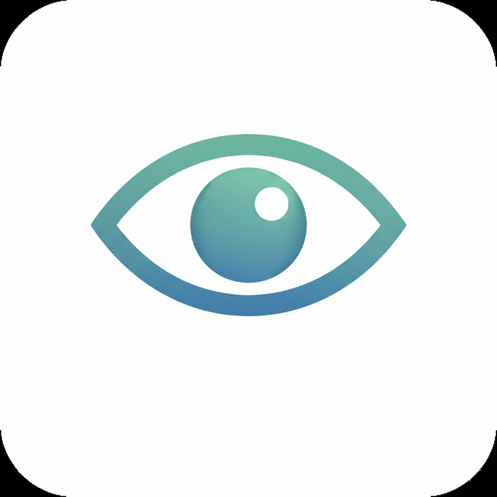

# Blink

A minimal macOS menu bar app that reminds you to take regular eye breaks.

<p align="center">
  
</p>

## Why Blink?

Staring at screens for extended periods causes eye strain, dry eyes, and fatigue. The 20-20-20 rule recommends looking at something 20 feet away for 20 seconds every 20 minutes. Blink simplifies this with a customizable work-break rhythm and gentle full-screen reminders.

## Features

- **25/5 Rhythm** — Work for 25 minutes, take a 5-minute break (fully customizable)
- **Menu Bar Timer** — Always visible, shows elapsed or remaining time
- **Full-Screen Overlay** — Gentle reminder that covers all displays
- **Snooze & Skip** — Press Esc to snooze, double-Esc to skip
- **Global Shortcuts** — ⌘⇧B to pause/resume, ⌘⇧R to restart
- **Idle Detection** — Pauses automatically when you're away
- **Launch at Login** — Starts automatically with your Mac
- **Minimal & Native** — Built with SwiftUI, runs quietly in your menu bar

## Installation

### Download

1. Download `Blink.dmg` from the [latest release](https://github.com/rachitwatts/blink/releases/latest)
2. Open the DMG and drag **Blink** to your **Applications** folder
3. Launch Blink from Applications
4. First launch: Right-click → Open → Click "Open" (required for unsigned apps)

### Requirements

- macOS 14.0 (Sonoma) or later

## Usage

### Menu Bar

Click the timer in your menu bar to access controls:
- **Pause/Resume** — Pause the work timer
- **Restart Session** — Reset and start a new work session
- **Break Now** — Trigger an immediate break
- **Settings** — Configure durations and preferences

### Keyboard Shortcuts

| Shortcut | Action |
|----------|--------|
| ⌘⇧B | Pause/Resume timer |
| ⌘⇧R | Restart session |
| Esc | Snooze break (during overlay) |
| Esc Esc | Skip break (during overlay) |

> **Note:** Global shortcuts require Accessibility permission. Enable in Settings or System Settings → Privacy & Security → Accessibility.

### Settings

- **Work Duration** — How long to work before a break (1-60 min)
- **Break Duration** — How long each break lasts (1-30 min)
- **Display Mode** — Show elapsed time or countdown to next break
- **Sound** — Play a sound when break starts
- **Launch at Login** — Start Blink automatically

## Building from Source

### Prerequisites

- macOS 14.0+
- Xcode 15+
- [XcodeGen](https://github.com/yonaskolb/XcodeGen)

```bash
brew install xcodegen
```

### Build

```bash
# Clone the repository
git clone https://github.com/rachitwatts/blink.git
cd blink

# Generate Xcode project and build
xcodegen generate
xcodebuild -project Blink.xcodeproj -scheme Blink -configuration Release build
```

### Create DMG

```bash
./scripts/build-dmg.sh
```

### Create Release

```bash
./scripts/build-dmg.sh --release
```

### Run Tests

```bash
./scripts/run-tests.sh
```

See [TESTING.md](TESTING.md) for the complete test strategy.

## Project Structure

```
Blink/
├── BlinkApp.swift          # App entry point
├── Models/
│   ├── AppState.swift      # Observable app state
│   └── Settings.swift      # User preferences
├── Services/
│   ├── TimerEngine.swift   # Core timer logic
│   ├── IdleMonitor.swift   # System idle detection
│   ├── HotkeyManager.swift # Global keyboard shortcuts
│   └── LaunchAtLoginManager.swift
├── Views/
│   ├── MenuBarView.swift   # Menu bar dropdown
│   ├── BreakOverlayView.swift
│   ├── SettingsView.swift
│   └── OnboardingView.swift
└── Windows/
    ├── BreakOverlayWindowController.swift
    ├── SettingsWindowController.swift
    └── OnboardingWindowController.swift
```

## License

MIT License — see [LICENSE](LICENSE) for details.

## Acknowledgments

- App icon generated with Google Gemini
- Built with SwiftUI and AppKit
